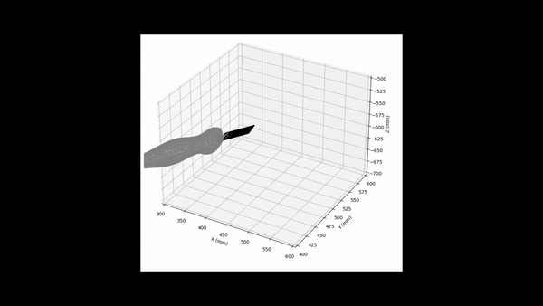

# 3D multimodal medical imaging technique based on freehand ultrasound, marker tracking, and 3D reconstruction

This is the main repository for the Python3-based 3D multimodal imaging technique using freehand ultrasound and marker tracking. The project is a part of the Neuro-Mechatronics Interfaces group at Carnegie Mellon University

With this proposed technique, we can obtain the internal structure with 3D freehand ultrasound to complement the design process of an HD-EMG sleeve with optimized electrode positioning. Our system is composed of 8 Vicon tracking cameras and an ultrasound machine.

<p align="center">
    
</p>

This project is inspired by [Jhacson Meza](https://jhacsonmeza.github.io/)'s work on [3D ultrasound reconstruction](https://arxiv.org/abs/2105.14355)

Note: This process assumes that the motion tracking data contains at least 3 markers on a plane to be able to reconstruct the pose of the ultrasound probe. The motion tracking data should be in the form of a CSV file with the following format:

## Dependencies
* [Python 3.8](https://www.python.org/downloads/)
* [Vicon Nexus 2.11](https://www.vicon.com/software/nexus/)

## Repository Structure
The following demonstrates the structure as well as useage of the folders and files:
* `dataset/`              - The primary directory containing the generated data
* `models/`               - The directory containing STL files used in visualization
* `1_process_us_video.py` - The script to process the ultrasound video
* `2_pose_estimation.py`  - Loads motion tracking data and estimates the pose of the ultrasound probe
* `3_multimodal_alignment.py` - Aligns the ultrasound and motion tracking data using correlation tecnique
* `4_reconstruction.py`   - Generates the 3D reconstruction of the ultrasound data

## Installation

To get started, clone the repository and navigate to the package directory:
```
git clone https://github.com/Neuro-Mechatronics-Interfaces/Python_Ultrasound_Reconstruction.git
cd Python_Ultrasound_Recunstruction
```
- (Optional) Installing packages locally in a virtual environment instead of the PC is optional but recommended:
  ```
  python -m venv py_us  
  ```
- Activate the new environment:
  ```
  # In cmd.exe
  py_us\Scripts\activate.bat
  # In PowerShell
  py_us\Scripts\Activate.ps1
  # On Linux and MacOS
  source py_us/bin/activate
  ```
- When you're done, to deactivate the virtual environment, you can run the `deactivate` command:
  ```
  deactivate
  ```
Install the python packages required for the project in the environment:
```
pip install -r requirements.txt
```
  - If it fails, try upgrading your pip version:
    ```
    python -m pip install --upgrade pip
    ```
    
## Usage
Set the path to the dataset in the `1_process_us_video.py` script and run the script to process the ultrasound video:
```
python 1_process_us_video.py
```
Set the path to the dataset in the `2_pose_estimation.py` script and run the script to estimate the pose of the ultrasound probe:
```
python 2_pose_estimation.py
```
Set the path to the dataset in the `3_multimodal_alignment.py` script and run the script to align the ultrasound and motion tracking data:
```
python 3_multimodal_alignment.py
```
Set the path to the dataset in the `4_reconstruction.py` script and run the script to generate the 3D reconstruction of the ultrasound data:
```
python 4_reconstruction.py
```


## Citation

